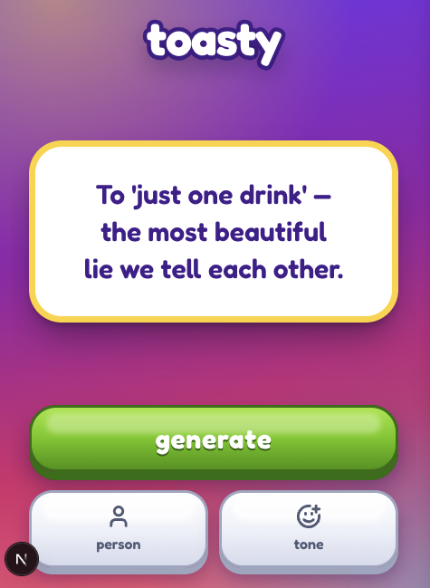
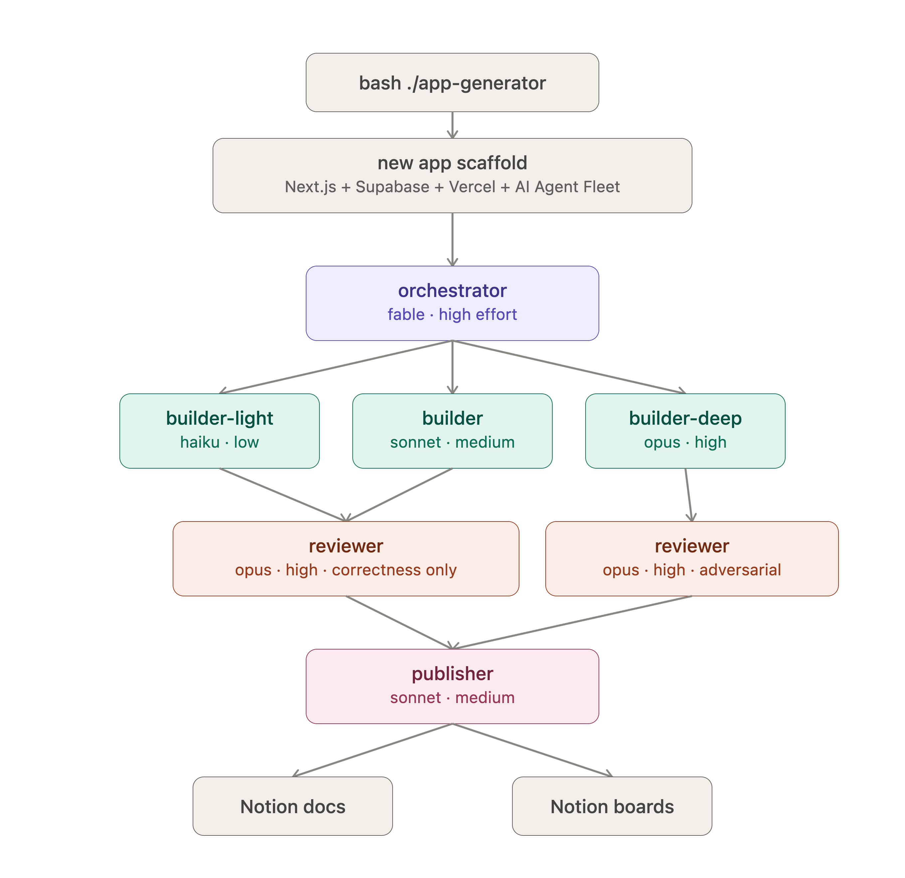
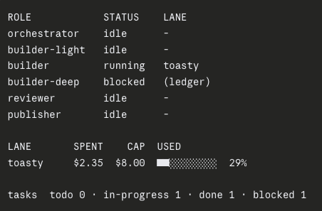

# toasty 🥂

## Problem

Glasses are in the air and every eye just landed on you. "Cheers" is all
you've got but you need something more, one good line before your beer goes flat.

## Solution

Open toasty and there's only one thing to do: tap **generate**

<p align="center">
  
</p>

toasty will give you a short, punchy toast, deserving of a cheers
- Not feeling it? Tap **generate** again
- Want to make it personal? tap **person** to add specific details about a person or event
- Want to set the vibe? tap **tone** to make your toast friendly, heartfelt, or a roast

## Under the hood

<p align="center">
  
</p>

<p align="center"><strong>Agent Graph</strong></p>

toasty was built by a small fleet of AI agents working in sequence:
- an orchestrator that breaks work into tasks
- builders of three sizes that pick them up
- reviewers that check the work
- a publisher that writes it all down

<p align="center">
  
</p>

<p align="center"><strong>Agent Status</strong></p>

## How to use

```bash
npm install
npm run dev
```

Open [http://localhost:3000](http://localhost:3000). toasty is mobile-first,
so shrink your window or grab your phone for the real feel. Tap **generate**,
read the card out loud, tap again if it's not the one. Prost!
